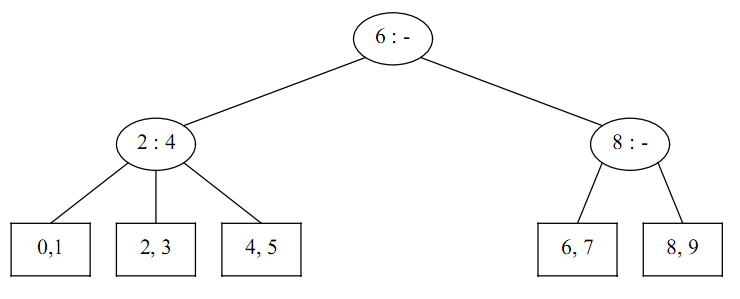
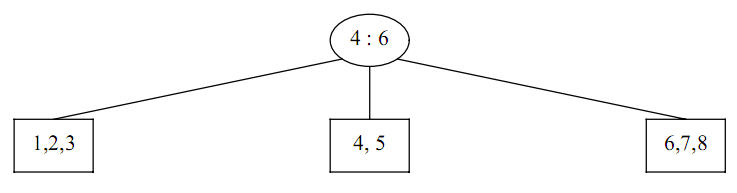
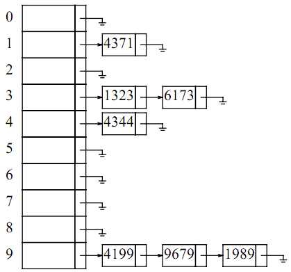
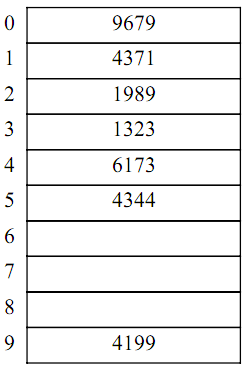
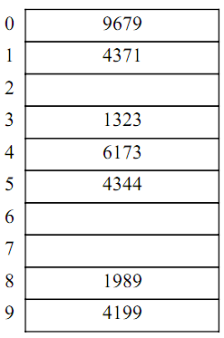
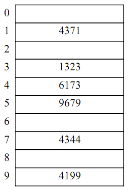
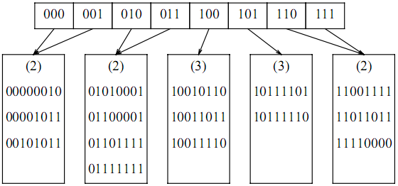

# 数据结构与算法分析


## 第三章课后习题

### 3.1

打印单链表的程序：https://github.com/tigood/DataStruct_C/blob/main/list_adt/src/list.c

### 3.2

> 如果仅仅使用基本的表操作的话，要实现该程序，需要用到两层循环，外层循环遍历`链表P`中的位置，内层循环根据外层循环提供的位置在`链表L`中寻找指定元素，由于是单链表，所以根据位置查找一个元素的平均时间复杂度为$O(n)$，而外层还有对于`链表P`的循环，所以整体的时间复杂度能达到$O(n^2)$

### 3.3

单链表的实现：https://github.com/tigood/DataStruct_C/blob/main/list_adt/src/list.c

### 3.4 and 3.5

对两个已排序链表实现交并集操作:
<br/>
<a href="https://github.com/tigood/DataStruct_C/blob/main/list_adt/src/list_more_func.c">list_more_func.c(功能实现部分)</a>
<br/>
<a href="https://github.com/tigood/DataStruct_C/blob/main/list_adt/include/list_more_func.h">list_more_func.h(功能头文件)</a>
<br/>
<a href="https://github.com/tigood/DataStruct_C/blob/main/list_adt/src/main.c">功能测试文件</a>


### 3.6 and 3.7 and 3.8

多项式的实现以及相关的操作：

实现代码文件：<a href="https://github.com/tigood/DataStruct_C/blob/main/list_adt/src/polynomial.c">polynomial.c</a>


### 3.9

任意精度整数运算包：

实现代码文件：<a href="https://github.com/tigood/DataStruct_C/blob/main/list_adt/src/big_int.c">bint_int.c</a>


### 3.10

**a**.这里就不写是实现代码了，简单讲一下优化思路

1. 最容易想到的方法就是遍历，根据输入的`M`值一次一次的遍历，这样的话时间复杂度就是`O(MN)`，对于一个较大的`M`是无法接受的。
2. 一种优化的思路：如果`M`大于一轮的情况下，我们直接遍历总会一轮一轮的经过原点，这些都是无意义的遍历，我们可以通过求模运算获得最后一次不到一轮的遍历，这样就省去了中途多余的一些遍历。即`move_counts = M % N`
3. 还有一种优化的思路：我们也可以通过反向移动的方法来减少移动的次数，这种实现就需要用到**双向链表**了。当移动的次数`M`大于`N`的一半并小于`N`的是时候，正向移动`M`次就等于反向的移动`N - M`次，即`move_counts = N - M`，这里要反向移动，判断条件为：`if((M > N / 2) && M < N)`

**b**.时间复杂度为：$O(N * min(N, M))$

**c**.如果`M`为$1$的话，那么运行时间就是线性的，取决于N，即$O(N)$。如果`N`很大的话，在这个程序中，这些节点都需要通过`free`来释放空间的话，这个释放空间的操作的占比就比较大了，就会影响一定的运行速度


### 3.11 and 3.12

代码实现文件：

<a href="https://github.com/tigood/DataStruct_C/blob/main/list_adt/src/list.c">list.c</a>

3.12反转的另一种实现方式：

这种实现方式也可以，不过我没有在代码实现文件中写这一种，代码如下，可以参考代码研究一下思路。

```c
List ReverseList(List l) {
    Position CurrentPos, NextPos, PreviousPos;
    
    PreviousPos = NULL;
    CurrentPos = l; // 当前指向链表头
    while (CurrentPos != NULL) { // 只要当前节点不为 NULL
        NextPos = CurrentPos->next; // 保存当前节点的下一个节点
        CurrentPos->next = PreviousPos; // 反转当前节点的指针
        PreviousPos = CurrentPos; // 移动 PreviousPos 到当前节点
        CurrentPos = NextPos; // 移动到下一个节点
    }
    return PreviousPos; // 返回新的头节点（原链表的最后一个节点）
}
```


### 3.13 and 3.14

这两个题目涉及到了后续课程，目前我还没有学到，暂不实现

### 3.15

**a**.

实现代码文件：<a href="https://github.com/tigood/DataStruct_C/blob/main/list_adt/src/self_adjusting/self_adjusting_arr.c">self_adjusting_arr.c</a>

实现头文件：<a href="https://github.com/tigood/DataStruct_C/blob/main/list_adt/include/self_adjusting/self_adjusting_arr.h">self_adjusting_arr.h</a>

**b**.

实现代码文件：<a href="https://github.com/tigood/DataStruct_C/blob/main/list_adt/src/self_adjusting/self_adjusting_list.c">self_adjusting_list.c</a>

实现头文件：<a href="https://github.com/tigood/DataStruct_C/blob/main/list_adt/include/self_adjusting/self_adjusting_list.h">self_adjusting_list.h</a>

**c**.

emm..具体的论证就不写了，每次访问一个元素的时候都会将这个元素移动到表头，那么如果一个元素访问的频率较高，它就会经常被移到表头，虽然后面被访问的元素会将其顶开，但是访问频率高的由于会经常再被提到表头，这样访问频率高的都会表头附近循环，就会比较靠近表头。可能听着比较绕，但是意思是很简单的，细细品味一下。

### 3.16

**c**.

> 如果通过数组实现的话，删除操作的`O(N)`的，所以如果只是经过简单的判断，它可以达到一个`O(N^3)`的时间复杂度，但是实际上，只能达到`O(N^2)`的时间复杂度，因为如果对所有的元素都进行了删除操作，那么它就不需要进行外面的下一轮了。

**d**.

> 链表实现的时间复杂度也为`O(N^2)`

**e**.

> 先进行排序，再进行删除相同元素（这时候相同的元素都是相邻的，一次遍历就可以完成删除）

### 3.17

**a**.

> 优点有：程序容易编写，如果被删除的元素可能在之后重新被插入到相同的位置，那么懒惰删除可能省去插入的开销。
>
> 缺点有：使用了更多的空间，因为每个元素都有一个附加的域（通常占一个字节），并且被删除的元素的空间没有释放。

**b**.

实现头文件：<a href="https://github.com/tigood/DataStruct_C/blob/main/unit_3_exs/3.17/include/list_lazy_del.h">list_lazy_del.h</a>

实现代码文件：<a href="https://github.com/tigood/DataStruct_C/blob/main/unit_3_exs/3.17/src/list_lazy_del.c">list_lazy_del.c</a>

测试文件：<a href="https://github.com/tigood/DataStruct_C/blob/main/unit_3_exs/3.17/src/test.c">test.c</a>

### 3.18

**a**.

实现代码：<a href="https://github.com/tigood/DataStruct_C/blob/main/unit_3_exs/3.18/src/check_balanced_func.c">check_balanced_func.c</a>

**b**.

> 如果打印错误的信息，在我上面的代码中有体现，可以查阅代码研究一下，如果您有更好的错误提示方案，欢迎补充！

### 3.19

实现代码：<a href="https://github.com/tigood/DataStruct_C/blob/main/stack_adt/src/calcuation_text/calcuation.c">calcuation.c</a>

### 3.20

**a** and **b**.

实现代码：<a href="https://github.com/tigood/DataStruct_C/blob/main/stack_adt/src/calcuation_text/calcuation.c">calcuation.c</a>

**c**.

实现代码：<a href="https://github.com/tigood/DataStruct_C/blob/main/stack_adt/src/suffix_to_infix.c">suffix_to_infix.c</a>

### 3.21

实现代码：<a href="https://github.com/tigood/DataStruct_C/blob/main/unit_3_exs/3.21/src/two_stacks_by_one_arr.c">two_stacks_by_one_ayy.c</a>

头文件：<a href="https://github.com/tigood/DataStruct_C/blob/main/unit_3_exs/3.21/include/two_stacks_by_one_arr.h">two_stacks_by_one_arr.h</a>

### 3.22

**a**.

实现代码：<a href="https://github.com/tigood/DataStruct_C/blob/main/unit_3_exs/3.21/src/two_stacks_by_one_arr.c">two_stacks_by_one_ayy.c</a>

头文件：<a href="https://github.com/tigood/DataStruct_C/blob/main/unit_3_exs/3.21/include/two_stacks_by_one_arr.h">two_stacks_by_one_arr.h</a>

**b**.

> 这个证明需要第七章中排序一定会花费 时间的结论。进行O(N)次的取出最小元素(FindMin)+压入另一个栈(Push)+删除最小元素(DeleteMin)，可以完成排序，所以一次FindMin+Push+DeleteMin操作的时间界为，所以它们三个不能同时需要O(1)时间。

### 3.23

> 三个栈可以通过如下方式实现：一个从数组底端向上增长，一个从数组顶端向下增长，第三个可以从中间开始，向某个方向增长。如果第三个栈和其他两个栈中的一个冲突，就需要移动它。一个合理的策略是把它移动到使它的中心距其他两个栈栈顶元素相等的位置。

### 3.24

> 栈空间不会用完，因为只有49次调用储存在栈空间中。然而，如第二章所述，它的运行时间是指数型的，因此例程不会在合理的时间内结束。
>
> 栈的深度最多的一刻到了49，所以不会用完

### 3.25

**a**.

队列的链表实现：

实现代码：<a href="https://github.com/tigood/DataStruct_C/blob/main/queue_adt/src/queue_list.c">queue_list.c</a>

实现头文件：<a href="https://github.com/tigood/DataStruct_C/blob/main/queue_adt/include/queue_list.h">queue_list.h</a>

**b**.

队列的数组实现：

实现代码：<a href="https://github.com/tigood/DataStruct_C/blob/main/queue_adt/src/queue_arr.c">queue_arr.c</a>

实现头文件：<a href="https://github.com/tigood/DataStruct_C/blob/main/queue_adt/include/queue_arr.h">queue_arr.h</a>

### 3.26

实现代码文件：<a href="https://github.com/tigood/DataStruct_C/blob/main/unit_3_exs/3.26/src/deque.c">deque.c</a>

实现代码头文件：<a href="https://github.com/tigood/DataStruct_C/blob/main/unit_3_exs/3.26/include/deque.h">deque.h</a>


## 第四章课后练习题

### 4.1

> **a.**  A是根节点
>
> **b.** G  H  I  L  M  K 是叶节点

### 4.2

> A节点：没有父节点  |  子节点：B  C  |  没有兄弟节点  |  深度为0  |  高度为4
>
> B节点：父节点为A  |  子节点：D  E  |  兄弟节点：C  |  深度为1  |  高度为3
>
> C节点：父节点为A  |  子节点：F  |  兄弟节点：B  |  深度为1  |  高度为2
>
> 剩下的以此类推 

### 4.3

> 树的深度为4

### 4.4

> 在一个有**N**个节点的二叉树中，每一个节点最多可以有两个子节点，即延伸出两条连接线，一共有**2N**个指针。**N**个节点需要有**N - 1**条直线连接，所以实际被使用了**N - 1**个指针，其余的指针未被使用，则为空指针，即**N + 1**个空指针

### 4.5

> 节点最多的二叉树情况为满二叉树
>
> 即节点数量为 1 + 2^1 + 2^2 + 2^3 + ..... + 2^i
>
> 第i层有**2^i**个节点
>
> 可以发现该式子为一个等比数列
>
> 根据等比数列的和公式就可以得出**2^(h + 1) - 1**的结论

### 4.6

> 假设树一共有`N`个节点，那么它就有`N - 1`条边
>
> 其中满节点（有两个子节点）定义为`N2`，单子节点声明为`N1`，叶节点声明为`N0`
>
> 有以下两个式子：
>
> 式子1：`N2 + N1 + N0 = N`
>
> 式子2：`N2 * 2 + N1 * 1 + N0 * 0 = N - 1` 
>
> 将式子1代入式子2：
>
> `N2 * 2 + N1 * 1 + N0 * 0 = N2 + N1 + N0 - 1`
>
> 化简得到：`N0 = N2 + 1`
>
> 即证明满节点的个数加1等于非空二叉树的树叶个树

### 4.7

*以下内容来自于ChatGpt*

> ### 1. 问题描述
>
> 假设有一棵二叉树，树上有 iii 个叶子节点，每个叶子的深度是 did_idi。我们需要证明：
>
> ∑12di≤1\sum \frac{1}{2^{d_i}} \leq 1∑2di1≤1
>
> 并且找出什么情况下等号成立。
>
> ### 2. 二叉树结构与路径比例的关系
>
> 二叉树中的每个节点可以看作是把从根到叶子节点的路径分成了两部分：左子树和右子树。因此，从根节点出发，每一层深度会把可能的路径数分割成更小的份数。
>
> - 在深度 d=0d = 0d=0 时，根节点有 111 条完整路径。
> - 在深度 d=1d = 1d=1 时，路径数变为 222，因为根节点有两个子节点。
> - 在深度 d=2d = 2d=2 时，路径数变为 444，依此类推。
>
> 因此，深度为 did_idi 的叶子节点，它所占的路径比例是 12di\frac{1}{2^{d_i}}2di1。这意味着树的每个叶子节点的路径长度越长，它的路径“占比”越小。
>
> ### 3. 总路径占比
>
> 对于一棵二叉树，所有叶子的路径总和占据整个树的路径空间。这就像把一块蛋糕切成很多小份，每一份代表一个叶子的路径占比。显然，这些小份加起来不可能超过整个蛋糕，也就是总和不会超过 1。
>
> 我们要证明的是：
>
> ∑12di≤1\sum \frac{1}{2^{d_i}} \leq 1∑2di1≤1
>
> 这实际上意味着，所有叶子的路径比例之和不能超过 1。
>
> ### 4. 等号成立的条件
>
> 要让等号成立，树必须是**满二叉树**，并且所有叶子节点必须在同一深度。
>
> 在这种情况下，每个叶子节点的路径长度相同，所有路径均匀分布，等号成立。举个简单例子：
>
> - 如果有 2 个叶子节点，深度都是 1，那么：
>
> 121+121=1\frac{1}{2^1} + \frac{1}{2^1} = 1211+211=1
>
> - 如果有 4 个叶子节点，深度都是 2，那么：
>
> 122+122+122+122=1\frac{1}{2^2} + \frac{1}{2^2} + \frac{1}{2^2} + \frac{1}{2^2} = 1221+221+221+221=1
>
> 在这个情况下，每个叶子节点的路径都占了同样大小的比例。
>
> ### 5. 总结
>
> - 这证明了所有叶子节点路径的倒数之和不会超过 1，这是因为每个叶子的路径分割了整棵树的路径空间，而路径不能重叠或超出总量。
> - 等号成立时，树是满二叉树，所有叶子节点在同一深度。

### 4.8

> 前缀表达式：`- * * a b + c d e`
>
> 中缀表达式：`((a * b) * (c + d)) - e`
>
> 后缀表达式：`a b * c d + * e -`

### 4.9

> **a.**
>
> ```bash
>    3
>   / \
>  1   4
>   \   \
>    2   6
>       / \
>      5   9
>         /
>        7
> ```
>
> **b.**删除根节点之后
>
> ```bash
>    4
>   / \
>  1   5
>   \   \
>    2   6
>         \
>          9
>          /
>         7
> ```
>
> 

### 4.10

> 代码实现：<a href="https://github.com/tigood/DataStruct_C/blob/main/binary_search_tree_adt/src/binary_search_tree.c">binary_search_tree.c</a>
>
> 头文件：<a href="https://github.com/tigood/DataStruct_C/blob/main/binary_search_tree_adt/include/binary_search_tree.h">binary_search_tree.h</a>

### 4.11

> 代码实现：<a href="https://github.com/tigood/DataStruct_C/blob/main/unit_4_exs/4.11/src/binary_search_tree_ptr.c">binary_search_tree_ptr.c</a>
>
> 头文件实现：<a href="https://github.com/tigood/DataStruct_C/blob/main/unit_4_exs/4.11/include/binary_search_tree_ptr.h">binary_search_tree_ptr.h</a>

### 4.12

> (a) 维护一个位数组B。如果i在树上，令B[i]为true，反之为false。不断产生随机数知道找到一个不在树上的数。如果树上有N个元素，那么有M-N个数不在树上，所以找到一个不在树上的数的概率是(M-N)/M，因此尝试次数的数学期望为M/(M-N)=α/(α-1)
>
> (b) 为了找到一个已在树上的数，不断产生随机数直到产生一个已经在树上的数。每次产生出满足条件的数概率是N/M，所以次数的数学期望是M/N=α。
>
> (c) 一次insert和delete操作的总花费是α/(α-1)+ α=1+α+1/(α-1)。α=2时取得最小值。

### 4.13

> 既然题目说了凭经验，个人感觉是C

### 4.14

> 证明随机二叉查找树（Random Binary Search Tree, RBST）深度的平均值为 O(log⁡N)O(\log N)O(logN) 可以基于概率分析和期望值来进行。简要的证明思路如下：
>
> 1. **构建递归模型**：在 RBST 中，每个节点有相等的概率作为根节点，并将剩余节点分为左右子树。子树的大小近似于平均分配，因此问题可归结为递归分析。
>
> 2. **递归关系**：根据随机划分规则，树的深度 D(N)D(N)D(N) 满足以下递归方程：
>
>    D(N)=1+1N∑i=1N−1max⁡(D(i),D(N−i))D(N) = 1 + \frac{1}{N} \sum_{i=1}^{N-1} \max(D(i), D(N-i))D(N)=1+N1i=1∑N−1max(D(i),D(N−i))
>
>    这表示根节点深度加上左右子树的最大深度。
>
> 3. **期望深度计算**：通过数学归纳法，或利用 Chernoff Bounds 等高级概率工具可以证明，树的期望深度（即平均深度）近似为 O(log⁡N)O(\log N)O(logN)。
>
> 4. **直观解释**：由于树的节点近似均匀分布在左右子树中，平均情况下，树是平衡的，导致树的高度为 O(log⁡N)O(\log N)O(logN)。

### 4.15

> **a.**
>
> 精确表达式为：N(h) = N(h - 1) + N(h - 2) + 1，其中N(0) = 1，N(1) = 2;
>
> **b.**
>
> N(15) = N(14) + N(13) + 1 = 986 + 610 + 1 = 1597

### 4.16

> ```bash
>      4
>     / \
>    2   6
>   / \ / \
>  1  3 5  9
>         /
>        7
> ```

### 4.17

> 很容易在纸上验证对1<=k<=3，命题是成立的。设命题对k=1, 2, 3, …, H均成立。当k=H+1时，分析如下：
>
> 在经过前 次插入操作后， 位于根，且右子树是一个含有 到 的平衡树。接下来 个，也就是第 到第 个插入操作中的每一个都给树插入了一个新的最大值并且插入到右子树中，最终形成一个高度平衡的右子树。这一点可以从归纳假设得出，因为右子树可以看作由$2^{H - 1} + 1$到$2^H + 2^{H - 1} - 1$ 这一段连续的整数插入形成的，正好有 $2^{H} - 1$个。下一次插入在根产生了不平衡，引起一次单旋转。容易验证这次单旋转使 $2^H$成为新的根，并形成了一个高为H-1的完全平衡的左子树。刚刚插入的新元素依附在高度为H-2的完全平衡的右子树上。因此右子树正好可以看成是$2^H + 1$到$2^H + 2^{H - 1}$被依次插入形成的。由归纳假设，接下来的$2^H + 2^{H - 1} + 1$到$2^{H + 1} - 1$这些数的插入会形成一个高为H-1的完全平衡的右子树。因此在最后一次插入之后，左子树和右子树都完全平衡，且高度相同，因此整个 $2^{H + 1} - 1$个节点构成的数也是完全平衡的（且高度为H）

### 4.18 and 4.19 and 4.20

> 代码实现：<a href="https://github.com/tigood/DataStruct_C/blob/main/avl_tree_adt/src/avl_tree.c">avl_tree.c</a>
>
> 头文件代码：<a href="https://github.com/tigood/DataStruct_C/blob/main/avl_tree_adt/include/avl_tree.h">avl_tree.h</a>

### 4.21

> **a.**
>
> 位数与表示的数值范围密切相关。一个整数的表示所需的位数是其二进制表示长度。假设需要表示的数为 xxx，那么表示这个数所需的位数为 ⌈log⁡2(x+1)⌉\lceil \log_2(x + 1) \rceil⌈log2(x+1)⌉，即表示该数所需的最小二进制位数。
>
> 对于 AVL 树，每个节点的高度最大为 O(log⁡N)O(\log N)O(logN)，因此表示这个高度的位数需要 log⁡2(log⁡N)\log_2(\log N)log2(logN)，即 O(log⁡log⁡N)O(\log \log N)O(loglogN) 位。这个关系说明了位数随数值的增长速率比数值本身增长得慢。
>
> **b.**
>
> $2^8 - 1$ 即为高度是255的树

### 4.22

> ```c
> static Position double_rotate_with_left_plus(Position k3) {
>     Position k1, k2;
>     k1 = k3->left;
>     k2 = k1->right;
> 
>     // 重构
>     k1->right = k2->left;
>     k3->left = k2->right;
>     k2->left = k1;
>     k2->right = k3;
>     // 更新高度
>     k1->height = max(height(k1->left), height(k1->right)) + 1;
>     k3->height = max(height(k3->left), height(k3->right)) + 1;
>     k2 = max(height(k1), height(k3)) + 1;
> 
>     return k2;
> }
> ```

### 4.23

> 访问3之后
>
> ```bash
>            3
>          /   \
>         2    10
>        /    /  \
>       1    4    11
>             \     \
>              6    12
>             / \    \
>            5   8    13
>               / \
>              7   9
> ```
>
> 访问9之后
>
> ```bash
>         9
>       /   \
>      3     10
>     / \      \
>    2   4      11
>   /     \      \
>  1       6      12
>         /  \     \
>        5    8     13
>              \
>               7
> ```
>
> 访问1之后
>
> ```bash
>            1
>          /   \
>         2     9
>             /   \
>            3     10
>             \     \
>              4     11
>               \     \
>                6     12
>               / \     \
>              5   8     13
>                 /
>                7
> ```
>
> 访问5之后
>
> ```bash
>             5
>           /   \
>          1      9
>         / \    /  \
>        2   3   6   10 
>             \    \   \
>              4    8   11
>                  /     \
>                 7       12
>                          \
>                           13
> ```
>
> 

### 4.24

> ```bash
>               7
>             /   \
>            5     9
>           /     / \
>          1     8  10
>         / \          \
>        2   3          11
>             \           \
>              4           12
>                           \
>                            13
> ```

### 4.25

> **a.**
>
> 内部路径长度可以通过将每个节点的深度想加得到
>
> 即 0 + 1 + 2 + 3 + ... + (N - 1)
>
> 通过等差数列公式可以算出来为：(1024 * 1023) / 2 = 523776
>
> **b.**
>
> 262166, 133114, 68216, 36836, 21181, 13873
>
> **c.**
>
> 执行Find(9)之后

### 4.26

> **a.**
>
> 在伸展树中，每次访问的元素都会被提到顶部，如果按顺序访问所有的元素的话，那么他们会先到顶部，然后因为下一个元素的值一定比当前元素大，所以上一个元素会被旋转到当前元素的左子树中，经历一整轮之后就会形成一连串左子树形成的伸展树
>
> **b.**

### 4.27

> 略

### 4.28

> 以下这三个实现的时间复杂度都是线性的
>
> ```c
> // 计算书中节点个树
> int count_tree_nodes(AvlTree avl_tree) {
>     if (avl_tree == NULL) {
>         return 0;
>     }
>     return 1 + count_tree_nodes(avl_tree->left) + count_tree_nodes(avl_tree->right);
> }
> ```
>
> ```c
> // 计算树中有几个叶子节点
> int count_tree_leaves(AvlTree avl_tree) {
>     if (avl_tree == NULL) {
>         return 0;
>     } else if (avl_tree->left == NULL && avl_tree->right == NULL) {
>         return 1;
>     } else {
>         return count_tree_leaves(avl_tree->left) + count_tree_leaves(avl_tree->right);
>     }
> }
> ```
>
> ```c
> // 计算树中有几个满节点
> int count_tree_full_nodes(AvlTree avl_tree) {
>     if (avl_tree == NULL) {
>         return 0;
>     } else if (avl_tree->left && avl_tree->right) {
>         return 1;
>     } else {
>         return count_tree_full_nodes(avl_tree->left) + count_tree_full_nodes(avl_tree->right);
>     }
>     // 或者写成这样
>     // return (avl_tree->left && avl_tree->right) + count_tree_full_nodes(avl_tree->left) + count_tree_full_nodes(avl_tree_right)
> }
> ```

### 4.29

> 例程的实现：<a href="https://github.com/tigood/DataStruct_C/blob/main/unit_4_exs/4.29/src/test.c">test.c</a>
>
> 时间复杂度的话，如果插入的序列是有序的，那么这就是最坏的结果，它的时间复杂度可以达到$O(n^2)$
>
> 如果是随机的话，那么每一个节点的平均插入时间复杂度可以达到$O(logn)$，所以一共就是$O(nlogn)$

### 4.30

> *该例程实现的是一个最少节点的avl二叉树*
>
> 即(核心伪代码如下)
>
> ```c
> tree->left = generate_tree(height - 1);
> tree->right = generate_tree(height - 2);
> ```
>
> 例程的实现：<a herf="https://github.com/tigood/DataStruct_C/blob/main/unit_4_exs/4.30/src/test.c">test.c</a>
>
> 时间复杂度为：$O(2^H)$ 其中H为高度
>
> 空间复杂度为：$O(H)$

### 4.31

> *该例程实现的是一个最多节点的avl二叉树*
>
> 即(核心伪代码如下)
>
> ```c
> tree->left = generate_tree(height - 1);
> tree->right = generate_tree(height - 1);
> ```
>
> 例程的实现：<a herf="https://github.com/tigood/DataStruct_C/blob/main/unit_4_exs/4.31/src/test.c">test.c</a>
>
> 时间复杂度为：$O(2^H)$ 其中H为高度
>
> 空间复杂度为：$O(H)$

### 4.32

> ```c
> void print_range(ElementType lower, ElementType upper, SearchTree tree) {
>     if (tree != NULL) {
>         if (tree->elem >= lower) {
>             print_range(lower, upper, tree->left);
>         } else if (tree->elem >= lower && tree->elem <= upper) {
>             printf("%d  ", tree->elem);
>         } else if (tree->elem <= upper) {
>             print_range(lower, upper, tree->right);
>         }
>     }
> }
> ```
>
> 这被称作一维搜索问题。如果有非常多的节点被输出，那么执行遍历的时间将是O(K)，另外，时间也和树的深度成正比，因为我们可能一直向下搜索到树叶（比如不存在符合条件的节点）。因树的深度平均为O(logN)，所以有O(K + logN)的时间界

### 4.33 and 4.34

> 其中的一些证明很简单的，由于使用的前须遍历，所以先画当前节点，在左子树的节点，再右子树的节点，其中线条连接再中间完成。所以不会交叉的
>
> 看一看代码实现就理解了
>
> 头文件：<a herf="https://github.com/tigood/DataStruct_C/blob/main/unit_4_exs/4.33/include/search_tree.h">search_tree.h</a>
>
> 实现代码文件：<a herf="https://github.com/tigood/DataStruct_C/blob/main/unit_4_exs/4.33/src/search_tree.c">search_tree.c</a>

### 4.35

> 代码实现：
>
> <a herf="https://github.com/tigood/DataStruct_C/blob/main/unit_4_exs/4.35/src/main.c">main.c</a>

### 4.36

> **a.**
>
> 
>
> **b.**
>
> 

### 4.37

> b树的的实现代码：<a href="https://github.com/tigood/DataStruct_C/blob/main/b_tree_adt/src/b_tree.c">b_tree.c</a>
>
> 头文件：<a href="https://github.com/tigood/DataStruct_C/blob/main/b_tree_adt/include/b_tree.h">b_tree.h</a>

### 4.38

> 内部节点的儿子数在`2M / 3`和`M`之间，就说明键的数量为`2M / 3 - 1`到`M - 1`之间.
>
> 即`5`阶`b*-树`的关键字数量为`4`到`5`个。
>
> 插入的时候，如果关键字数量未满就直接插入，如果要插入节点已满，就查看兄弟节点是否有空间，如果兄弟节点有空间，就通过**旋转操作**将目标节点中的一个关键字移入兄弟节点中，然后再进行插入。如果兄弟节点同样满了，那么就进行分裂操作，将中心节点提升到父节点中。重复以上的过程，直到整颗树的结构都符合定义要求

### 4.39 and 4.40

> 代码实现：<a href="https://github.com/tigood/DataStruct_C/blob/main/unit_4_exs/4.39/tree.c">tree.c</a>
>
> 头文件：<a href="https://github.com/tigood/DataStruct_C/blob/main/unit_4_exs/4.39/tree.h">tree.h</a>

### 4.41

> ```c
> bool similar(BinaryTree T1, BinaryTree T2) {
>     if (T1 == NULL || T2 == NULL) {
>         return T1 == NULL && T2 == NULL;
>     }
>     return similar(T1->left, T2->left) && similar(T1->right, T2->right);
> }
> ```
>
> 时间复杂度是线性的

### 4.42

>算法的时间是线性的：实现如下：
>
>```c
>bool is_isomorphic(Tree t1, Tree t2) {
>    // 如果都为空，返回真
>    if (t1 == NULL && t2 == NULL) {
>        reutrn true;
>    }
>    // 如果其中一个不为空，或者二者都不为空但是节点的值不同，返回假
>    if (t1 == NULL || t2 == NULL || t1->value != t2->value) {
>        return false;
>    }
>    
>    // 检查两种情况，左右子树分别同构的，或者左右子树交换后同构的
>    return (is_isomporphic(t1->left, t2->left) && is_isomporphic(t1->right, t2->right) || (is_isomporphic(t1->left, t2->right) && is_isomporphic(t1->right, t2->left));
>}
>```

### 4.43

> 证明略

### 4.44

>为每一个节点增加一个域，该域存储以它为根的左子树的大小，可以通过中序遍历实现这一点，这样如果要找第5小的，只需要找到该域的值为4的哪一个节点

### 4.45

> **a.**
>
> 我们需要通过增加额外的域来标记子树是否为线索
>
> (c) 从某种程度上可以更简单的对树进行遍历且不需要递归。

### 4.46

> 


## 第五章课后练习题

### 5.1

> **a.**
>
> 
>
> **b.**
>
> 
>
> **c.**
>
> 
>
> **d.**
>
> 

### 5.2

> 将表的大小扩展为2倍之后，找到这个大小最近的第一个素数，将这个树作为新的表大小，然后重新进行散列

### 5.3

> ```c
> #include <stdio.h>
> #include <stdlib.h>
> #include <time.h>
> 
> #define TABLE_SIZE 101   // 哈希表大小（选用一个素数）
> #define PRIME 97         // 双散列使用的辅助素数，要求小于 TABLE_SIZE
> #define NUM_INSERTS 50   // 插入元素的数量
> 
> int linearProbe(int hash, int i) {
>     return (hash + i) % TABLE_SIZE;
> }
> 
> int quadraticProbe(int hash, int i) {
>     return (hash + i * i) % TABLE_SIZE;
> }
> 
> int doubleHash(int key, int i) {
>     int hash1 = key % TABLE_SIZE;
>     int hash2 = PRIME - (key % PRIME);
>     return (hash1 + i * hash2) % TABLE_SIZE;
> }
> 
> void resetTable(int *table) {
>     for (int i = 0; i < TABLE_SIZE; i++) table[i] = -1;
> }
> 
> int insertLinear(int *table, int key) {
>     int hash = key % TABLE_SIZE;
>     int i = 0, conflicts = 0;
>     while (table[linearProbe(hash, i)] != -1) {
>         conflicts++;
>         i++;
>     }
>     table[linearProbe(hash, i)] = key;
>     return conflicts;
> }
> 
> int insertQuadratic(int *table, int key) {
>     int hash = key % TABLE_SIZE;
>     int i = 0, conflicts = 0;
>     while (table[quadraticProbe(hash, i)] != -1) {
>         conflicts++;
>         i++;
>     }
>     table[quadraticProbe(hash, i)] = key;
>     return conflicts;
> }
> 
> int insertDoubleHash(int *table, int key) {
>     int i = 0, conflicts = 0;
>     while (table[doubleHash(key, i)] != -1) {
>         conflicts++;
>         i++;
>     }
>     table[doubleHash(key, i)] = key;
>     return conflicts;
> }
> 
> int main() {
>     int table[TABLE_SIZE];
>     int conflictsLinear = 0, conflictsQuadratic = 0, conflictsDouble = 0;
> 
>     // 初始化随机数种子
>     srand(time(NULL));
> 
>     // 生成随机序列并分别插入到每种哈希表中
>     for (int i = 0; i < NUM_INSERTS; i++) {
>         int key = rand() % 1000;  // 生成一个随机键值
> 
>         // 线性探测
>         resetTable(table);
>         conflictsLinear += insertLinear(table, key);
> 
>         // 平方探测
>         resetTable(table);
>         conflictsQuadratic += insertQuadratic(table, key);
> 
>         // 双散列
>         resetTable(table);
>         conflictsDouble += insertDoubleHash(table, key);
>     }
> 
>     printf("Total conflicts using Linear Probing: %d\n", conflictsLinear);
>     printf("Total conflicts using Quadratic Probing: %d\n", conflictsQuadratic);
>     printf("Total conflicts using Double Hashing: %d\n", conflictsDouble);
> 
>     return 0;
> }
> ```

### 5.4

>该表的装填因子至少要小于0.25

### 5.5

> **a.**
>
> 因为每一个表项都将被探测到，所以如果表不满，冲突一定会被解决掉
>
> **b.**
>
> 这种消除了一次聚集，但是没有消除二次聚集，因为所有的元素均使用的同一种解决冲突的序列
>
> **c. d.**
>
> 运行时间可能和平方探测相似。它的优点是除非表满了否则插入不会失败。
>
> **e.**

### 5.6

> 分离链接散列表需要使用指针，这会占用空间，并且引起调用空间配置例程的开销，这通常是昂贵的。线性探测易于实现，但在装填因子增大时因为一次聚集它的表现严重下降。平方探测实现起来只稍稍比线性探测复杂，且在实践中有很好的表现。但在表半满的时候插入可能失败，不过这不经常出现。再散列消除了一次和二次聚集，但是需要使用合理的hash函数才会产生好的结果

### 5.7

> **a.**
>
> 代码实现如下：
>
> <a href="https://github.com/tigood/DataStruct_C/blob/main/unit_5_exs/5.7/src/main.c">main.c</a>
>
> **b.**
>
> 两种方式在计算多项式乘积的时候的时间复杂度都会是O(MN)，他们的区别就在与最后排序的时候需要排序的数量级，无论乘积结果如何，第一种方法的数量级都会是M * N，而第二种的数量级则是最后合并之后的输出项数，这里根据题义就是M + N，排序的时间复杂度还是取决于采用什么样的排序算法，第二种的数量级更加的小

### 5.8

> 一个字符占1个字节，平均有7个字符，然后装入8个字节的空间中。一共有30000个单词，由于装入开放定址表，所以这里装填因子要维持在0.5以内，所以要大小要可以容纳60000个单词，即60000 * 8字节，480000字节。

### 5.9

> **a.**正确，如果散列到的位置值为0，说明这个还未被填充过，该单词当然不在词典中。
>
> **b.**不正确，在30000个单词中，有概率两个单词通过哈希函数计算出来的索引相同，所以这个位置所代表的可能是另一个计算的结果索引一致的另一个单词。
>
> **c.** `TableSize`的大小为300007，每一个单元为一个位的大小，即300007 / 8个字节，即约37501个字节
>
> **d.** 一共有30000个单词，然后`TableSize`大小为300007，实际占用率为`10%`，所以在插入的时候有`10%`的概率探测到一个冲突的单元格，所以错误率也为`10%`。
>
> **e.** 如果使用当前的300007的容量来存储，感觉错误率还是太大了，可以通过提高这个值来降低错误率，虽然正确率不能达到100%，但是实际中这个算法可以解决大部分的拼写检查工作。

### 5.10

> 避免初始化散列表的目的就是为了优化空间使用，让单元格在没有元素占据的时候呈现为空指针或者NULL。我们可以通过为每一个单元增加一个额外的字段`WhereOnStack`，并且使用一个额外的栈。如果是第一次向一个单元格中插入元素的时候，我们就将该元素压入栈中，然后让字段`WhereOnStack`指向该栈现在的栈顶元素。然后以后在插入元素之前就根据`WhereOnStack`字段来判断当前的位置是否已经有了元素，如果没有就执行上面的操作，如果已经有了，我们再考虑是否要为该单元格开辟新的空间存储这些元素。

### 5.11

> **a.** 这两个字符串的区别就在于头尾元素的变化，我们这里使用**滚动哈希**技术，我们根据哈希函数，移除旧的字符在哈希函数中的贡献值，然后增加新的字符对哈希函数的贡献值，这个计算出来的值就是新的哈希值
>
> **b.** 首先计算目标子串的哈希值，这个过程的时间复杂度为O(k)，然后，我们遍历主字符串，逐一比对哈希值，直到找到哈希值相等的位置，这代表着该子串与这部分可能相等，紧接着为了验证是否相等就是进行假匹配（这一部分时间复杂度先忽略）。第二部分的时间复杂度为O(N)，所以这一过程的总时间复杂度为O(k + N)（忽略掉假匹配过程）
>
> **c.** 如果我们的哈希函数设计的足够优秀的情况下，假匹配基本一次就会通过，所以这里的假匹配的期望并不高。
>
> **d.** 代码实现：<a href="https://github.com/tigood/DataStruct_C/blob/main/unit_5_exs/5.11/str_match.c">str_match.c</a>

### 5.12

> 代码实现：<a href="https://github.com/tigood/DataStruct_C/blob/main/unit_5_exs/5.12/main.c">main.c</a>

### 5.13

> 代码实现：<a href="https://github.com/tigood/DataStruct_C/blob/main/unit_5_exs/5.13/word_serach.c">word_search.c</a>

### 5.14

> 

### 5.15

> 如果表小到装入内存，它的性能是比不过分离链接法和开放定址法的。因为在找到树叶之后，它还需要在树叶中进行一个线性时间复杂度的查找，它的优势在于装入磁盘之后，减少了磁盘的访问次数，而不在于在内存中进行检索。


## 第六章课后练习题

